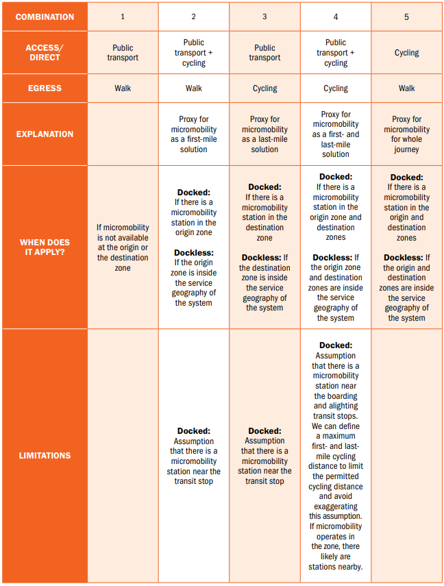
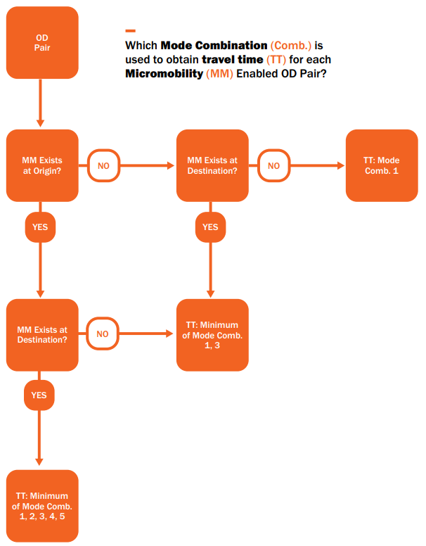

# All Possible Commutes
This repository contains scripts and datasets from the study "*All Possible Commutes - How Micromobility and Realistic Car Travel Times Impact Accessibility Analyses*". The study was conducted by [Transport for Cairo (TfC)](https://transportforcairo.com/) and the [New Urban Mobility Alliance (NUMO)](https://www.numo.global/). The published report and technical appendix can be found [here](https://www.numo.global/resources/all-possible-commutes-accessibility-analysis-micromobility-paper).
 
 ## Repository Overview
 
 The repository is organised into the following folders: 
 ### code
Scripts and edited software tools that comprises the data pipeline enabling accessibility modeling as per our methodology. Pipeline sequence is as follows:
1. **Pre-processing**: Set of scripts to download and process data from online sources and prepare datasets for analysis.
2. **pbf_augmenter**: Python script that embeds road segment speed data into an OSM PBF road network. More details on this process can be found in the section on [editing osm pbf files](#editing-osm-pbf-files).
3. **Analysis**: Scripts used for calculating travel time matrices and accessibility measures. More details on this process can be found in the section on [micromobility and accessibility](#micromobility-and-accessibility).
4. **Equity**: These scripts are for the equity analysis conducted for the cities of San Francisco and Minneapolis
### data
intermediate and final data outputs from the analysis. Includes a ["Data Guide" spreadsheet](https://github.com/transportforcairo/wri-numo_access-analysis/blob/main/data/Data_Guide.xlsx) with metadata documentation.
### data_raw
Compiled datasets from multiple sources for chosen cities, includes:
 - GTFS
 - OSM road network
 - GBFS
 - Demographic data
### visuals
Figures and visualizations generated for the report in original quality

## Methods 

### Editing OSM pbf files

#### Sourcing the data 

Freely available, updated data on road-segment level speeds is hard to come across. We used the Uber movement speed dataset [(link)](https://movement.uber.com/explore/london/speeds/query?lang=en-GB&dt[tpb]=ALL_DAY&dt[wd;]=1,2,3,4,5,6,7&dt[dr][sd]=2020-03-01&dt[dr][ed]=2020-03-31&ff=) as well as proprietary Mapbox data. Both give speed data for each OSM road segment, linking the data to the OSM Way ID

#### Using the data for routing 

To add traffic data onto road network segments, we need to edit the OSM pbf file that r5 uses to build the routable graph. There is a discussion in r5r about enabling this functionality, but it is still a work in progress [(link)](https://github.com/ipeaGIT/r5r/issues/289). 

Each segment in the speed datasets is labelled with an OSM way ID which can be matched to the way IDs from a recent download of the OSM road network. This underlines the operability of the speed datasets because OSM networks are consumed by many routing engines.  The [script](https://github.com/transportforcairo/wri-numo_access-analysis/blob/main/code/2_pbf_augmenter/Maxspeed_setter_wfunctions.py) written for this task takes in the road network in .osm format, matches the real speed observed on each way or partial way, and adds a maxspeed tag with the real speed to the copied ways or partial ways. This is because the r5 routing engine uses the maxspeed tag to calculate travel times on roads if they are present. If a maxspeed tag is not available for a road, r5 uses a default based on the road type. The data is matched to the latest OSM build of the road network to create an updated PBF file. 

@ ADHAM - can you (a) edit and elaborate on the method below, and (b) point to specific scripts / even lines of code from our open github repo :

* Convert pbf file to xml
  - What package did you use?
* Use the xml.etree.EleentTree python module to query the xml file
  - Replace maxspeed:car values with values from Uber data
  - Elaborate on logic
* Convert xml to pbf
  - package?

### Micromobility and accessibility

The capabilities of open-source routing engines to model micromobility are a recent development. A standard for micromobility data [(GBFS – General Bikeshare Feed Specification)](https://github.com/MobilityData/gbfs) has been widely adopted only in the past few years. This standard makes (real-time) micromobility data feeds available through an API, and support for it has been added to OpenTripPlanner [link](https://docs.opentripplanner.org/en/v2.0.0/Configuration/#gbfs-configuration). While it is useful for trip planning purposes, a live API does not give us the flexibility required for analysing accessibility or for modeling scenarios.   

#### Approach 

Our proposed approach uses GBFS feeds to obtain the geographic scope of micromobility services, and then uses cycling as a proxy for micromobility when calculating travel times for multimodal trips. The logic is as follows: 
1. Create a variable hexagon grid over the study area (using [this script](https://github.com/transportforcairo/wri-numo_access-analysis/blob/main/code/1_Preprocessing/2.0_variable_hexgrid.R)). This step is optional, as one could use a uniform grid. We prefer to use small (400m diameter) hexagons to justify the assumption that people inside a hexagon have the same public transport and micromobility options. Creating a uniform 400m hexagon layer to cover any big city can lead to computationally expensive routing in step 4 (for n zones, we have n2 calculations). To reduce the number of calculations, we can create this variable hexagon grid where hexagons are smaller for high population/employment density areas, and larger in low population/emploment density areas. 
2. Identify locations of micromobility (using [this script](https://github.com/transportforcairo/wri-numo_access-analysis/blob/main/code/1_Preprocessing/1_extract-get_gbfs.R))
   - Docked: station locations 
   - Dockless: service area 
3. For each zone (grid unit), determine whether it is served by micromobility or not (using [this script](https://github.com/transportforcairo/wri-numo_access-analysis/blob/main/code/1_Preprocessing/2.3_transform-gbfs2zones.R)). For each zone, we consider availability of micromobility at neighboring zones as well. 
4. Determine travel time between each zone pair, i.e., OD-pair, using availability of micromobility to determine possible intermodality. Cycling is used as a proxy for micromobility when specifying modes in the routing engine. We create multiple travel time matrices using different mode combinations (see Table 1) . This is done using [this script](https://github.com/transportforcairo/wri-numo_access-analysis/blob/main/code/3_Analysis/3.1_analysis-travel_time_r5.R))
5. Use results from steps 3 and 4 to get travel time using micromobility for each OD pair. The travel times are based on the availability of micromobility, as shown in the table below. This is done using [this script](https://github.com/transportforcairo/wri-numo_access-analysis/blob/main/code/3_Analysis/3.2_analysis-travel_time_scenarios.R)).

 

The flowchart below shows the heuristic used to determine which mode combination to use for each OD pair

 
 

#### Examples of Results

##### Spatial Distribution of Docked Micromobility (Cairo, Egypt)

##### Accessibility to Jobs - Improvement due to Docked Micromobility (Cairo, Egypt)

